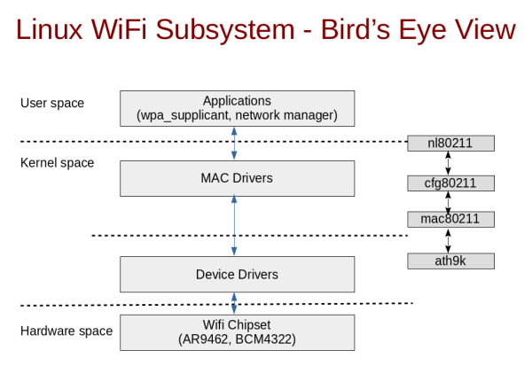

for kernel 4.19

# Goal:
analyse when kernel receive generical netlink message, how kernel processing it.

# file description:
1. nl80211.c: interface for wireless generic netlink programming, in /net/wireless dir, is cfg80211 module 
2. nl80211.h: the data structure for nl80211.c, in /net/wireless dir, is cfg80211 module 
3. genetlink.h: genl data structure, in your system /usr/src/linux-head-xxx/include/net dir
4. genetlink.c: genl operation, the interface for nl80211.c, in linux-source/net/netlink dir, is netlink_diag module
5. netlink.h: netlink operation, in your system /usr/src/linux-head-xxx/include/net dir
6. nlattr.c: netlink attribute operation, in linux-source/lib dir

# Ongoing:
1. kernel received message put into genl_info, how kernel put it?
2. use nl80211.c's function process it, for example, nl80211_get_wiphy
3. and then put the processed message into struct sk_buf 


# 编译cfg80211模块
进入内核的源码目录net/wireless

1.修改trace.h文件中的最后的路径为当前目录的路径

2.把Makefile删掉

添加这个Kbuild文件,然后执行下面的命令

```make -C /lib/modules/$(uname -r)/build/ M=$PWD```

# TO DO
how the kernel get struct genl_info

# Info:
</img>

# Data structure
| File | Data structure/Function | Description | Link
| :---- | :---- | :---- | :---- |
| include/net/mac802.11.h | ```struct ieee80211_tx_info``` | | |
| include/linux/skbuff.h | skb_put_data | copy data to skb | |
| include/linux/netdevice.h | ```struct net_device_ops``` | This structure defines the management hooks for network devices | [link](https://elixir.bootlin.com/linux/latest/source/include/linux/netdevice.h#L1381) |
| include/linux/skbuff.h | ```struct sk_buff``` |  a metadata structure and does not hold any packet data(?) | [link](https://elixir.bootlin.com/linux/latest/source/include/linux/skbuff.h#L1004) |
| uapi/linux/if_ether.h | skb->protocol | ```struct sk_buff``` protocol filed(only ethernet frame type?) | [link](https://elixir.bootlin.com/linux/latest/source/include/uapi/linux/if_ether.h) |
| include/uapi/linux/nl80211.h | ```enum nl80211_iftype``` | (virtual) interface types | [link](https://elixir.bootlin.com/linux/latest/source/include/uapi/linux/nl80211.h#L3302) |
| /net/core/dev.c | ```netif_rx``` | send buffer to network stack | [link](https://elixir.bootlin.com/linux/v4.13/source/net/core/dev.c#L3902) |
# Ubuntu linux header
/usr/src

# Download your system kernel 
## 1. get your kernel release
uname -r

## 2. find the kernel source 
* https://kernel.ubuntu.com/git/ubuntu/ubuntu-focal.git/refs/tags (Ubuntu)
* https://gitlab.com/kalilinux/packages/linux (Kali linux)

## 3. download specific directory
* https://github.com/chen172/ruby_script/tree/main/download_cgit_directory (Ubuntu)
* diret download from web ui, gitlab support download directory (Kali linux)

### reference
https://elixir.bootlin.com/linux/v4.13/ident/skb_put_data
